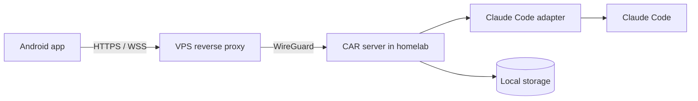

# Code All Remote (CAR)

**Code All Remote** is a self-hosted, Android-first control plane for AI coding agents running in a homelab. Its first adapter targets Claude Code; its core is deliberately agent-neutral.

CAR lets a user start, observe, steer, approve and resume coding-agent sessions remotely. The phone is a first-class work surface—not merely a terminal mirror.

## Product principles

- **Android first.** The primary workflows must work well on a phone.
- **Local first.** Projects, transcripts, credentials and audit data remain in the homelab.
- **Adapter based.** Claude Code is the first integration, not the system boundary.
- **Explicit authority.** Commands that require approval are visible and auditable.
- **Reconnectable.** A client can lose connectivity without losing the underlying session.

## Intended topology

The VPS is a network entry point only. It must not persist agent data.

## Documentation

Start with [the vision](docs/00-vision.md), then read the [architecture](docs/03-architecture.md), [MVP definition](docs/08-mvp.md), and [roadmap](docs/07-roadmap.md). Architectural decisions live under [`adr/`](adr/).

## Status

Documentation foundation. No production implementation exists yet.

