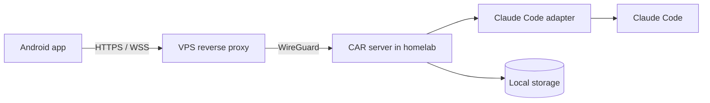

# Code All Remote (CAR)

**Code All Remote** is a self-hosted, Android-first control plane for AI coding agents running in a homelab. Its first adapter targets Claude Code; its core is deliberately agent-neutral.

CAR lets a user start, observe, steer, approve and resume coding-agent sessions remotely. The phone is a first-class work surface—not merely a terminal mirror.

## Product principles

- **Android first.** The primary workflows must work well on a phone.
- **Local first.** Projects, transcripts, credentials and audit data remain in the homelab.
- **Adapter based.** Claude Code is the first integration, not the system boundary.
- **Explicit authority.** Commands that require approval are visible and auditable.
- **Reconnectable.** A client can lose connectivity without losing the underlying session.

## Intended topology

The VPS is a network entry point only. It must not persist agent data.

## Documentation

Start with [the vision](docs/00-vision.md), then read the [architecture](docs/03-architecture.md), [MVP definition](docs/08-mvp.md), and [roadmap](docs/07-roadmap.md). Architectural decisions live under [`adr/`](adr/).

## Status

Implementation of milestones M1–M5 is complete. The Go core (server, adapters,
storage, WebSocket gateway, identity, audit, plugin SDK), the Android client
(Kotlin/Compose with a typed REST/WS SDK), deployment packaging, and `carctl`
backup/restore are implemented and covered by tests.
Status is **`accepted`** (approved by owner, 2026-07-18). Both CI workflows are
green on the submitted commit `25bfc6d` — `ci` (gofmt/vet/`go test -race`/
govulncheck/schema/docs) and `android` including the instrumented emulator job
(HomeComposeTest ×2, DeepLinkGuardTest ×4). Acceptance evidence is recorded in
`tasks/25-post-review-closure.md` and `REVIEWER_REPORT.md`.

See [DEVELOPMENT.md](DEVELOPMENT.md) for the build/test commands and the
current repository structure.

