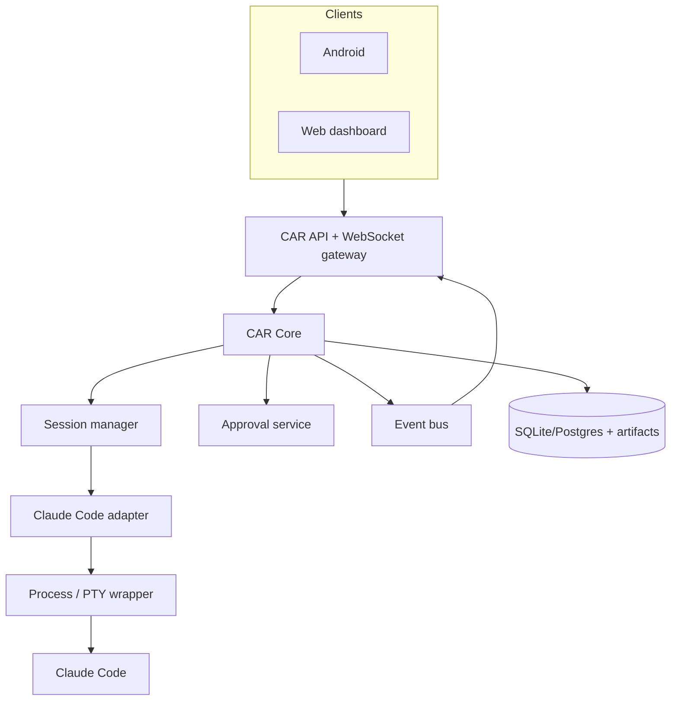

# Architecture

## Context

CAR wraps a locally installed agent rather than invoking an LLM provider directly. The adapter owns agent-specific process and output behavior; the core owns durable domain state, authorization and client contracts.

## Component boundaries

### CAR Core

Owns identity, authorization, workspaces, sessions, approvals, domain events, persistence and public contracts. It MUST NOT contain Claude-specific parsing or provider routing.

### Adapter

Converts agent-specific operations and output into CAR commands, snapshots and events. An adapter MUST declare its capabilities and version compatibility.

### Wrapper

Starts, stops and observes the child process. It captures terminal output and input, enforces workspace execution policy, and reports process health. It MUST NOT decide whether an action is authorized.

### Clients

Render server state and submit intents. They MUST treat the server as authoritative and recover state from a snapshot plus events.

## Data flow

1. A client creates a session for a workspace and adapter.
2. Core authorizes the request and asks the adapter to start a run.
3. Wrapper starts Claude Code locally; adapter normalizes output.
4. Core persists state and publishes ordered domain events.
5. Clients receive events over WebSocket and recover missed events by cursor.
6. A pending approval pauses the relevant adapter flow until a server-authorized decision arrives or expires.

## Trust boundaries

The phone-to-VPS connection is public-network traffic protected by TLS. The VPS-to-homelab connection is WireGuard traffic. The CAR server, agent process, storage and workspace are inside the trusted homelab boundary; nevertheless CAR applies least privilege between them.

