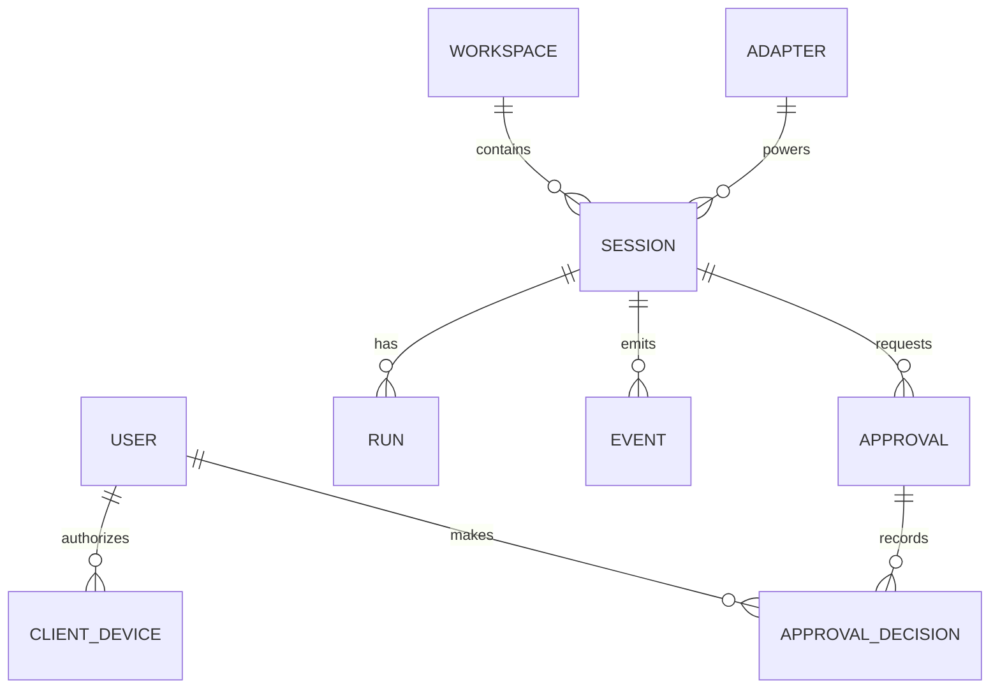

# Domain model

## Core entities

### Workspace

`id`, display name, canonical local path, execution policy, allowed adapters and repository metadata. A workspace is not an arbitrary client-supplied filesystem path: it MUST be registered by an administrator.

### Session

`id`, workspace ID, adapter ID, lifecycle state, creation time, last activity time, resume metadata and owner. A session survives client disconnection and server restart when its adapter supports restoration.

### Run

An execution attempt within a session. It records process identity, start/end timestamps, exit outcome and stream cursor range.

### Approval

`id`, session ID, action kind, human-readable context, structured payload, state, expiry and decision record. Approval states: `pending`, `approved`, `denied`, `expired`, `cancelled`.

### Event

An immutable record with monotonically increasing per-session sequence number, type, timestamp, actor and payload schema version. Events are the source for replay and timeline views.

