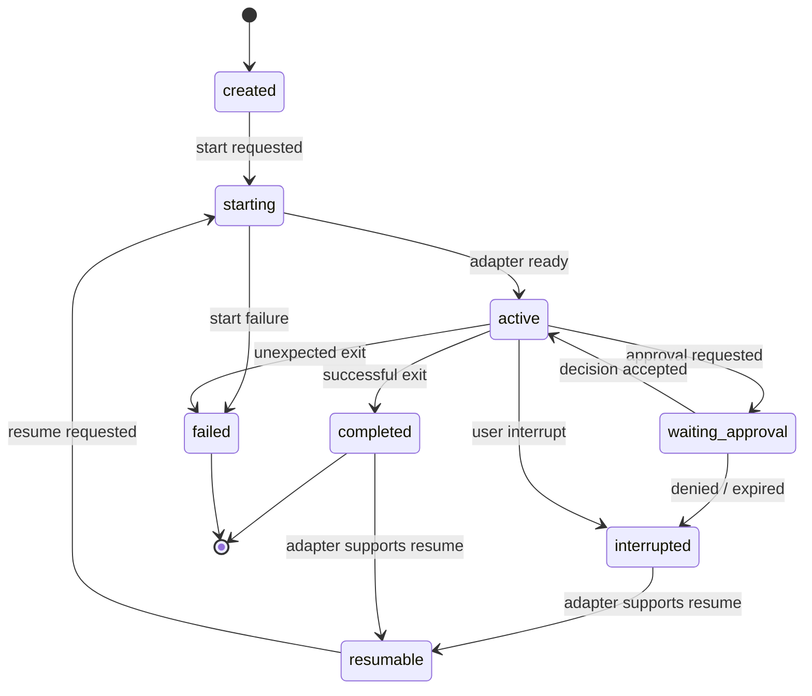

# Session lifecycle

## Purpose

This document specifies CAR's durable session and run model. It deliberately separates a user-visible **session** from a process-bound **run** so clients can reconnect and adapters can state when restoration is impossible.

## States

`waiting_approval` means the session needs an operator decision. It does not necessarily mean the child process is stopped: the adapter must expose whether it is blocked, still producing safe output, or has already exited.

## Invariants

- A session belongs to exactly one registered workspace and one adapter.
- At most one run may be active for a session.
- Every state transition is persisted and emits a session event.
- A client request carries an idempotency key; retrying it MUST NOT start a second run.
- On server start, CAR reconciles nonterminal runs with the wrapper's process registry before reporting them as failed.

## Recovery

After a mobile disconnect, a client fetches the session snapshot and requests events after its last acknowledged sequence. After a server restart, CAR marks an unverified active run as `recovering`, queries the adapter, then resolves it to `active`, `completed`, `failed`, or `resumable`.

## Acceptance criteria

- An interrupt racing with process exit produces one terminal outcome and a complete audit trail.
- A resumed session retains its original session ID and starts a new run ID.
- Unknown adapter recovery state is visible as `failed` with diagnostic context, never silently represented as active.

