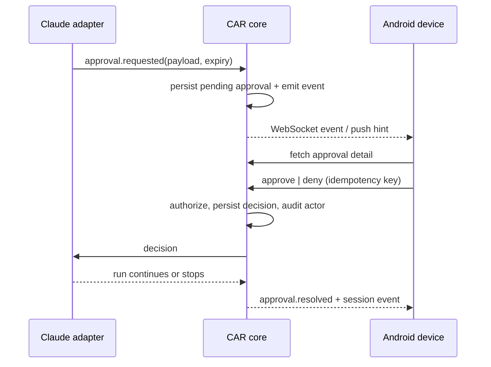

# Remote approvals

## Goal

Remote approval turns a blocking agent request into an explicit, authenticated server decision. It is not an instruction embedded in terminal text and it is not a blind push-notification action.

## Flow

## Approval record

The record includes an opaque ID, session/run IDs, action category, human summary, structured context, risk classification, creation time, expiration time, state and decision audit fields. Context MAY include a command or diff summary but MUST be redacted before delivery.

## Security rules

- Only a paired, authenticated device with approval permission may decide.
- Each decision is scoped to one pending approval and is idempotent.
- The server enforces expiry; the client clock is not authoritative.
- Push notifications contain no secrets and only enough context to prompt the user to open CAR.
- An `edit` action is deferred until adapters can safely represent constrained modified input; MVP supports approve and deny only.

## Failure behavior

If delivery fails, the approval remains pending until expiry or a connected client decides. If the adapter exits before resolution, CAR marks the approval `cancelled`. A late decision returns the final state and does not restart the agent.

