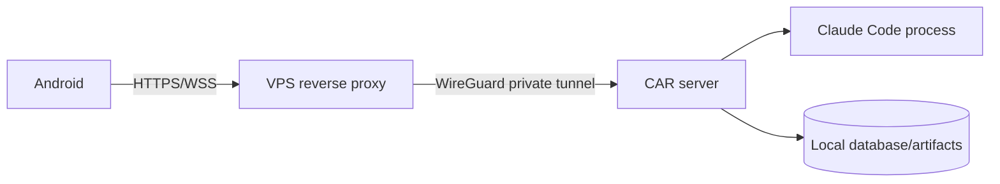

# Homelab and VPS deployment

## Topology

The VPS is stateless transport. It must not receive workspace mounts, database files, transcripts or long-lived CAR credentials.

## Deployment boundaries

- CAR binds to the WireGuard interface or loopback, not the public Internet interface.
- The reverse proxy forwards only the documented HTTPS and WebSocket routes.
- WireGuard peers are limited to the VPS and homelab CAR host.
- Homelab firewall rules deny direct public access to CAR and the agent process.
- Backups run from the homelab to owner-controlled encrypted storage.

## Operations

Health checks distinguish process liveness from readiness (database available, adapter executable discoverable, storage writable). Logs and metrics remain in the homelab unless the owner explicitly configures remote monitoring with redaction.

## Recovery

If the VPS fails, the homelab session continues locally. If WireGuard fails, Android reconnects later. If CAR restarts, session reconciliation follows `docs/10-session-lifecycle.md`. A documented restore test is required before calling a deployment production-ready.

